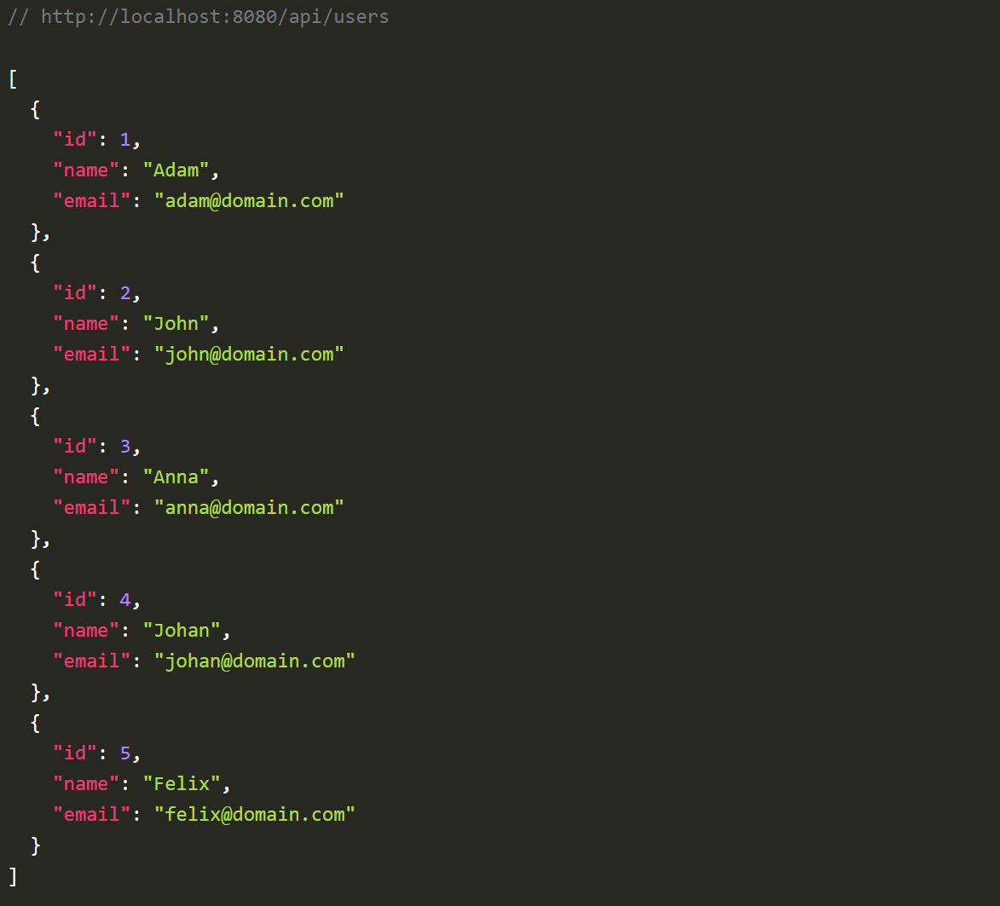

# User-API

## Beskrivning

Det här är en enkel **User-API**-app som används för att ansluta till en Angular frontend-applikation och visa användare. Applikationen tillhandahåller grundläggande funktioner för att hantera användare, inklusive att skapa och läsa.

## Funktioner

- Hämta alla användare
- Lägg till en ny användare
- Anslutning till Angular-frontend för att visa användare

## Teknologier som används

### Backend
- **Java**: För API:et.
- **Spring Boot**: För REST API-hantering.
- **H2 Database**: För att lagra användaruppgifter.
- **JPA (Java Persistence API)**: För databashantering.

### Frontend
- **Angular**: För att visa användarna i en enkel UI.

